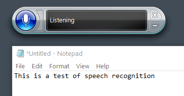
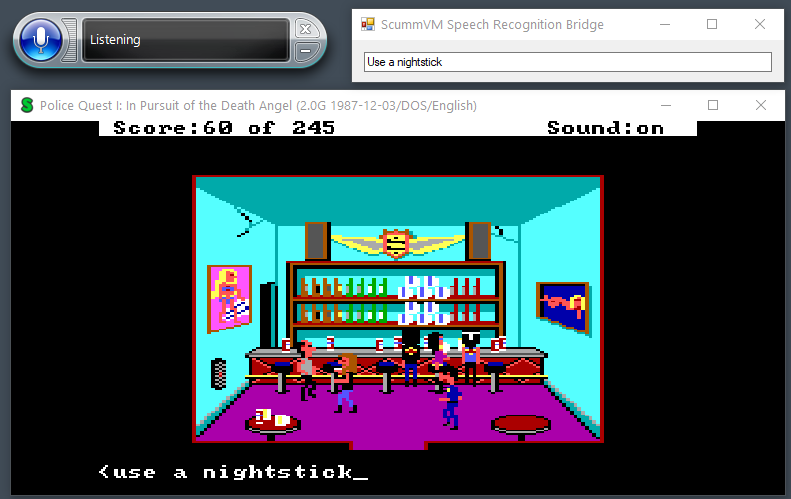

## ScummVM Speech Recognition Bridge

Use Windows Speech Recognition with ScummVM to dictate commands instead of typing in text parser adventure games.

See demonstration below:

### Notes

This is only a proof-of-concept, but working!

* Uses built-in voice recognition tech in Windows 10
* Allows push-to-talk to dictate commands
* Confirmed working with Sierra text parser adventure games
* Relies on switching app focus to the bridge when you are speaking, and back to ScummVM when you are not

### Instructions

1. Configure Speech Recognition in Windows 10 (Settings -> Speech settings). Make sure it works fine with Notepad for example.
Go through the microphone setup and training to make sure it works as best as it can. [Guide from Microsoft](https://support.microsoft.com/en-gb/windows/use-voice-recognition-in-windows-83ff75bd-63eb-0b6c-18d4-6fae94050571)

    

2. Download modified version of ScummVM which is able to communicate with the Bridge from below ([source code](https://github.com/mausimus/scummvm/tree/speech))

    https://github.com/mausimus/scummvm/releases/download/speech-0.1/scummvm.zip

3. Download the ScummVM Speech Recognition Bridge tool below.

4. Start up ScummVM, the Bridge and Windows Speech Recognition app.

5. Load up a text parser adventure game in ScummVM.

6. Start Speech Recognition by clicking the microphone icon on the Windows Speech Recognition app, it should say _Listening_.

7. Switch back to ScummVM.

8. Hold Tab on the keyboard and say something, you should see it appear in the Bridge and in ScummVM. Let go of the Tab key.

    

9. You can also use Right Trigger of an XBOX Controller instead of the Tab key if you have one.

10. Press Enter to commit the message. If you have a controller you can map one of its buttons to Confirm in ScummVM to avoid having to press Enter each time.

Enjoy...!
